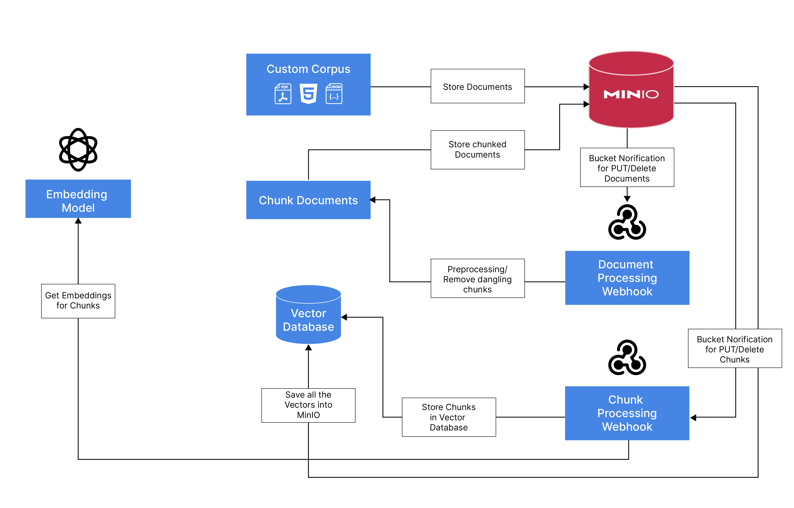

# RAG With MinIO

In this Repo, we will demonstrate how to use MinIO to build a Retrieval Augmented Generation(RAG) based chat application using commodity hardware.
* Use MinIO to store all the documents, processed chunks and the embeddings using the vector database.
* Use MinIO's bucket notification feature to trigger events when adding or removing documents to a bucket
* Webhook that consumes the event and process the documents using Langchain and saves the metadata and chunked documents to a metadata bucket
* Trigger MinIO bucket notification events for newly added or removed chunked documents
* A Webhook that consumes the events and generates embeddings and save it to the Vector Database (LanceDB) that is persisted in MinIO

## Architecture


## Key Tools Used
* **MinIO**  - Object Store to persist all the Data
* **LanceDB** - Serverless open-source Vector Database that persists data in object store
* **Ollama** - To run LLM and embedding model locally (OpenAI API compatible)
* **Gradio** - Interface through which to interact with RAG application
* **FastAPI** - Server for the Webhooks that receives bucket notification from MinIO and exposes the Gradio App
* **LangChain & Unstructured** - To Extract useful text from our documents and Chunk them for Embedding

### Models Uses
* **LLM** - Phi-3-128K (3.8B Parameters)
* **Embeddings** - Nomic Embed Text v1.5 ([Matryoshka Embeddings](https://arxiv.org/pdf/2205.13147)/ 768 Dim, 8K context)

## Setup

Install the required packages using the following command:
```bash
pip install -r requirements.txt
```

## Running the Application
You can follow the step by step described in the [Notebook](RAG-with-MinIO.ipynb) to run the application.